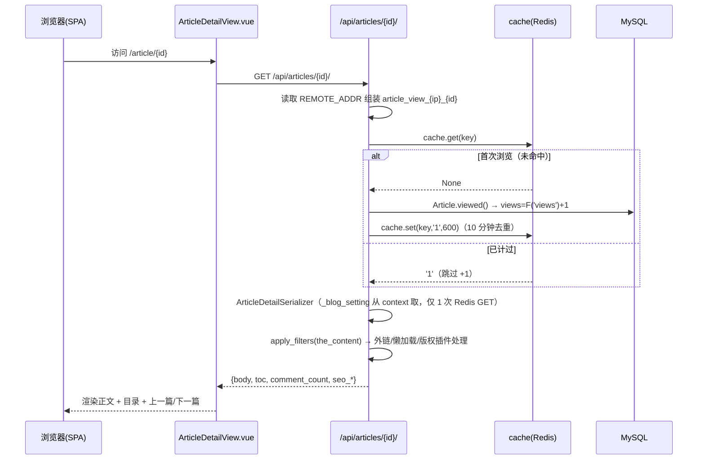
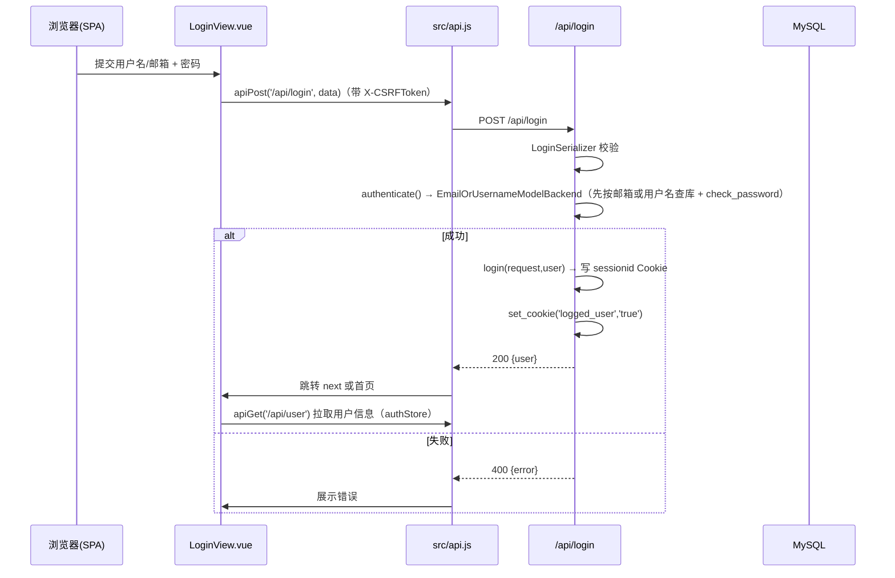
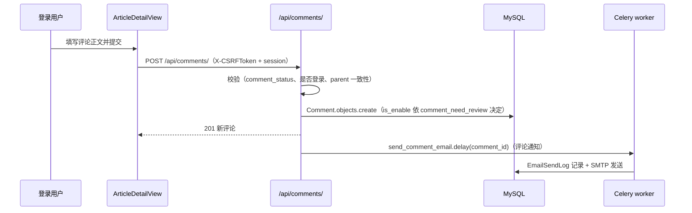

# WhrBlog 项目深度上手分析报告

> 生成方式：静态文本读取，未执行任何项目代码。
> 覆盖范围：后端（Django 5.2）、前端（Vue 3）、容器化部署、测试与 CI。

---

## 1. 项目概要

**一句话定位**：前后端分离的个人博客系统，Django 提供纯 REST API，Vue3 独立 SPA 消费接口，Docker Compose 一键部署 7 个服务。

| 元数据 | 值 |
|--------|-----|
| 项目名称 | whrblog（后端包 `whrblog`，前端包 `whrblog-frontend`） |
| Python 版本 | 3.12（Dockerfile 基础镜像 `python:3.12-slim`，CI 同样用 3.12） |
| Node 版本 | 20（`Dockerfile.frontend` 使用 `node:20-alpine`，CI 用 node 20） |
| 后端框架 | Django 5.2.16 + DRF 3.15.2 |
| 前端框架 | Vue 3.5 + Vite 6 + Tailwind CSS 3.4 |
| 后端包管理器 | pip + `requirements.txt`（无 pyproject.toml） |
| 前端包管理器 | npm（存在 `package-lock.json`，CI 用 `npm ci`） |
| 数据库 | MySQL 8.0（Docker Compose、CI 均一致） |
| 缓存 / 队列 | Redis 7 + Celery 5.6 |
| 搜索引擎 | Elasticsearch 9.4 + IK 中文分词（自构建 `deploy/es/Dockerfile`） |
| 架构类型 | **前后端分离同仓项目**（独立 `frontend/` 工程，Python 仅提供 API） |

---

## 2. 技术栈全景图

| 分类 | 技术 |
|------|------|
| Web 框架 | Django 5.2 + Django REST Framework 3.15 |
| WSGI 服务器 | Gunicorn（`deploy/gunicorn.conf.py`，生产） / `runserver`（开发） |
| 数据库 ORM | Django ORM + `mysqlclient`，Django migrations |
| 序列化校验 | DRF Serializer（3 个 app 各有 `serializers.py`） |
| 缓存 | Django RedisCache（`django.core.cache.backends.redis.RedisCache`） |
| 异步任务 | Celery 5.6（Broker/Result 均为 Redis，DB 1/2 号库） |
| 全文搜索 | `elasticsearch` Python 客户端（`core/es_client.py`，构建 IK 分词索引） |
| Markdown | `markdown` + `bleach` 白名单清洗（`core/utils.py`） |
| 图片处理 | Pillow（文章图床、头像压缩） |
| 邮件 | Django SMTP EmailBackend + Celery 异步发送 |
| 前端框架 | Vue 3（`<script setup>` Composition API） |
| 前端构建 | Vite 6（terser 深度压缩，`manifest: true`） |
| 前端状态 | Pinia（`src/stores/auth.js`、`src/stores/site.js`） |
| 前端路由 | Vue Router 4（`createWebHistory`） |
| 前端请求 | 原生 `fetch` 封装（`src/api.js`，无 axios） |
| CSS | Tailwind CSS + `@tailwindcss/typography` + PostCSS |
| 部署 | Docker Compose（7 服务）+ Nginx 反代 + GitHub Actions |

### 外部服务依赖

| 服务 | 用途 | 集成位置 |
|------|------|----------|
| MySQL | 主数据库 | `settings.py` DATABASES |
| Redis | 缓存 + Celery broker/result | `settings.py` CACHES / CELERY_* |
| Elasticsearch | 全文检索 | `core/es_client.py` |
| SMTP（QQ 邮箱） | 注册激活 / 找回密码 / 评论通知 | `settings.py` EMAIL_* + `core/tasks.py` |
| 无对象存储 / 支付 / 第三方登录 | — | 无 |

---

## 3. 目录结构与架构说明

```
whrblog/
├── apps/                          # 业务应用（Django 多应用布局）
│   ├── blog/                      # 文章、分类、标签、站点设置、搜索、图床、导入导出、草稿
│   │   ├── models.py              # Article / Category / Tag / Links / SideBar / BlogSettings
│   │   ├── serializers.py         # 全部博客序列化器（含 N+1 优化、_blog_setting context 缓存）
│   │   ├── api_views.py           # 全部博客 API 视图（715 行，核心模块）
│   │   └── urls.py                # /api/* 路由（SimpleRouter + 自定义端点）
│   ├── comments/                  # 评论、回复、表情反应
│   ├── accounts/                  # 注册登录、邮箱验证、账号中心、头像
│   └── servermanager/             # 命令备忘、邮件发送日志（纯数据模型）
├── core/                          # 横切能力（非 INSTALLED_APPS 的共享模块）
│   ├── utils.py                   # 缓存装饰器、Markdown、bleach 白名单、博客设置
│   ├── es_client.py               # ES 客户端单例、索引管理、搜索
│   ├── tasks.py                   # Celery 任务（ES 同步、发邮件）— 通过 CELERY_IMPORTS 引入
│   ├── blog_signals.py            # 全站信号（缓存失效、ES 异步索引、邮件）
│   ├── plugin_manage/             # 插件引擎（register / apply_filters）
│   ├── pagination.py              # 自定义分页（响应含 page / page_size）
│   ├── sitemap.py                 # sitemap.xml 各模型站点地图
│   ├── admin_site.py              # 自定义 admin site
│   └── error_views.py             # 404/500/403 统一错误页
├── plugins/                       # 内置插件（每个插件 = 一个包，含 plugin.py + __init__.py）
│   ├── external_links/            # 外链 target=_blank + rel=noopener
│   ├── image_lazy_loading/        # 图片懒加载 / 解码 / 响应式 / SEO alt
│   └── article_copyright/         # 文章底部版权声明
├── whrblog/                       # DJANGO 项目配置
│   ├── settings.py                # 全部配置（.env 驱动）
│   ├── urls.py                    # 根路由（admin / api / sitemap / health）
│   ├── wsgi.py / celery.py
│   └── management/commands/       # loadseed 等管理命令
├── frontend/                      # Vue3 SPA
│   ├── src/main.js                # 入口
│   ├── src/router.js              # 路由表（14 个页面）
│   ├── src/api.js                 # fetch 封装（CSRF + 401 拦截 + 文件下载）
│   ├── src/stores/                # Pinia（auth / site）
│   ├── src/views/                 # 14 个页面视图
│   ├── src/components/            # AppHeader / AppSidebar / AppFooter / PasswordInput
│   └── vite.config.js             # 开发代理 + 构建配置
├── deploy/                        # 部署（Dockerfile、nginx、entrypoint、env 模板、seed）
├── docker-compose.yml             # 7 服务编排
├── .env.example                   # 后端 env 模板
├── pytest.ini                     # 测试配置
├── .github/workflows/             # ci.yml + deploy.yml
└── requirements.txt               # 后端依赖
```

**架构模式总结**：
- 后端：Django 多应用 + DRF 视图集（ViewSet/APIView），薄序列化层，业务逻辑散落在 view 与 model 方法中（无独立 service 层）。
- 数据变更主要经 `core/blog_signals.py` 信号驱动「缓存失效 + ES 异步同步」，属于事件驱动旁路。
- 前端：特性拆分（views/组件/stores/features），请求封装统一在 `src/api.js`。
- `.env.example` 位于根目录，前后端共用一份环境变量。

---

## 4. 本地启动完整指南

### 前置依赖

| 依赖 | 版本 | 说明 |
|------|------|------|
| Docker + Docker Compose v2 | — | 推荐方式，一条命令启动全部中间件 |
| Python | 3.12 | 本地开发 |
| Node.js | 20 | 前端构建 |

### 快速启动命令速查表

| 动作 | 后端 | 前端 |
|------|------|------|
| 一键启动全部 | `docker compose up -d --build` | （同左） |
| 安装依赖 | `pip install -r requirements.txt` | `cd frontend && npm install` |
| 启动服务 | `python manage.py runserver` | `cd frontend && npm run dev` |
| 启动 Celery | `celery -A whrblog worker -l info --pool=solo`（Windows） | — |
| 跑测试 | `docker compose exec -T backend pytest` 或 `pytest` | — |

### 方式 A：Docker 一键（推荐）

```bash
cp .env.example .env        # 内置纯 Docker 开发默认值
docker compose up -d --build

# 可选：创建管理员
docker compose exec backend python manage.py createsuperuser

# 可选：导入 123 篇示例文章 + admin 账号
bash deploy/seed/load_seed.sh
```

验证入口：
- 前台：http://localhost/
- Admin：http://localhost/admin/
- API 探查：http://localhost/api/articles/
- 健康检查：http://localhost/health/

### 方式 B：本地开发

```bash
# 1. 中间件（MySQL / Redis / ES）用 docker-compose 只拉依赖服务
#    可临时 docker compose up -d mysql redis elasticsearch

# 2. 后端
pip install -r requirements.txt
cp .env.example .env
python manage.py migrate
python manage.py runserver

# 3. Celery（本地无 broker 时可加 --pool=solo；需机器可连 Redis）
celery -A whrblog worker -l info --pool=solo

# 4. 前端
cd frontend && npm install && npm run dev
```

### 联调验证

```bash
# 后端可访问
curl http://127.0.0.1:8000/health/
curl http://127.0.0.1:8000/api/siteinfo/

# 前端页面（浏览器）： http://localhost:5173
# 通过 vite proxy 转发 /api /media /admin /health 至后端 8000
```

---

## 5. 前后端联调机制说明

| 项目 | 配置 |
|------|------|
| 接口前缀 | 后端统一 `/api/`（DRF 路由），另有 `/admin/`、`/sitemap.xml`、`/health/` |
| 前端 baseURL | **无独立 baseURL**，直接相对路径 `fetch('/api/...')`，同域部署 |
| 跨域 | 后端**未装配** django-cors-headers；开发态由 Vite 代理实现同域，生产由 Nginx 同域反代 → 天然无跨域 |
| 认证传递 | Session Cookie（`sessionid` + `logged_user`），**非 JWT** |
| CSRF | 前端从 `csrftoken` Cookie 读取，POST/PATCH/DELETE 带上 `X-CSRFToken` 头（`src/api.js` 的 `jsonHeaders()`） |
| 401 处理 | `api.js:handle401` 全局拦截 401 → 跳 `/login?next=...` |
| 开发代理 | `vite.config.js:server.proxy`：`/api`、`/media`、`/static`、`/admin`、`/sitemap.xml`、`/health` → `http://127.0.0.1:8000`（可用 `API_PROXY_TARGET` 覆盖） |
| Session 同域 | 同域部署，无跨域 cookie 携带问题 |

> 关键设计：开发与生产均为**同域**（Vite 代理 → Nginx 同域），因此 Session Cookie 与 CSRF 无需额外跨域配置。

---

## 6. 核心入口与启动链路

### 后端

```
manage.py / gunicorn（wsgi:application）
  → whrblog/settings.py（load_dotenv 加载 .env）
  → whrblog/urls.py（admin_site / apps.blog.urls / apps.comments.urls / apps.accounts.urls / sitemap / health）
  → 导入 core/blog_signals.py（apps 启动时随 INSTALLED_APPS 注册 receiver，见注释「需要确认挂载点」）
  → plugins 由 settings.ACTIVE_PLUGINS（article_copyright / external_links / image_lazy_loading）+ loader.load_plugins() 注册到 the_content 钩子
  → 请求 → DRF（SessionAuthentication + IsAuthenticatedOrReadOnly + Anon/User 节流）→ ViewSet/APIView → Serializer
```

关键细节：
- WSGI 入口：`whrblog/wsgi.py:application`。
- Celery 入口：`whrblog/celery.py`，任务在 `core/tasks.py`，通过 `CELERY_IMPORTS = ('core.tasks',)` 显式引入。
- 项目启动不区分环境模块，全部由 `.env` 驱动（`DJANGO_DEBUG` 开关）。
- 插件加载链：`whrblog/apps.py → load_plugins()`（`core/plugin_manage/loader.py`）→ 三插件注册 `the_content` 过滤器 → `serializers.py:get_body` 中 `apply_filters(ARTICLE_CONTENT_HOOK_NAME, html, ...)` 消费。

### 前端

```
frontend/index.html（内联深色模式初始化脚本，防闪白）→ #app
  → frontend/src/main.js（createApp + Pinia + Router + initDarkMode）→ mount('#app')
  → App.vue（AppHeader + <router-view> + AppSidebar + AppFooter）
  → App.vue onMounted → siteStore.load()（/api/siteinfo/）+ authStore.load()（/api/user 仅登录态）
  → 各视图经 src/api.js（fetch）调用 DRF 接口
```

- 路由表 `src/router.js`：home / article / category / tag / author / links / search / login / register / forget-password / user / write / drafts / verify-email。
- 深色模式逻辑在 `src/features/darkMode.js`，主题状态写入 `document.documentElement[data-theme]`。
- 构建产物输出 `frontend/dist`，由 Nginx 托管；后端静态由 `collectstatic` 收集。

---

## 7. 数据模型与数据库

### 核心表清单

| 模型 | 表 | 职责 | 关键字段 |
|------|----|------|----------|
| `BlogUser` | accounts_bloguser | 用户（自 定义 User） | username / email / nickname / avatar / source / is_active |
| `Article` | blog_article | 文章与页面 | title / body / type(a=文章,p=页面) / status(d,p) / views / comment_status / show_toc / category / tags(M2M) |
| `Category` | blog_category | 分类（支持父级） | name / slug / parent_category(FK 自引用) / index 排序 |
| `Tag` | blog_tag | 标签 | name / slug |
| `Links` | blog_links | 友情链接 | name / link / show_type(i/l/p/a/s) / sequence |
| `SideBar` | blog_sidebar | 侧边栏公告 | name / content(Markdown) / sequence / is_enable |
| `BlogSettings` | blog_blogsettings | 站点配置（单例） | site_name / keywords / article_sub_length / sidebar_article_count / comment_need_review / color_scheme 等 |
| `Comment` | comments_comment | 评论与回复 | body / author / article / parent_comment(自引用) / is_enable(是否过审) |
| `CommentReaction` | comments_commentreaction | 评论表情反应 | comment / user / reaction_type（unique_together） |
| `commands` | servermanager_commands | 命令备忘 | title / command / describe |
| `EmailSendLog` | servermanager_emailsendlog | 邮件发送日志 | emailto / title / content / send_result |

### 表关系

- `Article` → `Category`：多对一（`on_delete=CASCADE`）
- `Article` → `Tag`：多对多（`Article.tags`）
- `Article` → `BlogUser(author)`：多对一
- `Category.parent_category`：自引用外键，实现多级分类（`BlogSettings`/`Category` 均有 `CASCADE`）
- `Comment` → `Article`、`Comment` → `BlogUser`：多对一 CASCADE；`Comment.parent_comment` 自引用实现回复
- `CommentReaction` 唯一约束 `(comment, user, reaction_type)`，杜绝重复点赞

### 数据库与迁移

- 引擎：MySQL 8.0，UTF-8/mb4，主机默认 `127.0.0.1:3306`（Docker 内为 `mysql:3306`），单数据源无读写分离。
- 迁移：Django migrations；命令 `python manage.py migrate`；CI 含 `makemigrations --check --dry-run` 校验遗漏迁移。
- 索引：`Article` 有 4 个组合索引（type/status/pub_time、status/views、author/status/type、category/status）；`Comment` 与 `CommentReaction` 也有针对性索引。

---

## 8. API 接口总览

路由组织：根 `whrblog/urls.py` 集中 + 各 app `urls.py` 分模块；博客与评论用 DRF `SimpleRouter`，账号用 `APIView` 显式 path。

### 公开接口（AllowAny）

| 模块 | 方法 | 路径 | 说明 |
|------|------|------|------|
| 博客 | GET | `/api/articles/` | 文章列表（分页，可 `?category=`/`?tag=`/`?author=` 过滤） |
| 博客 | GET | `/api/articles/{id}/` | 文章详情（含 body、toc、评论数、上下篇、SEO） |
| 博客 | GET | `/api/categories/` `/api/categories/{slug}/` | 分类列表 / 详情（含子分类树、article_count） |
| 博客 | GET | `/api/tags/` `/api/tags/{slug}/` | 标签列表 / 详情 |
| 博客 | GET | `/api/links/` | 友情链接 |
| 博客 | GET | `/api/sidebars/` | 侧边栏列表 |
| 博客 | GET | `/api/settings/` | 站点设置（只读） |
| 博客 | GET | `/api/search/?q=` | 全文搜索（ES 优先，ORM 回退） |
| 博客 | GET | `/api/sidebar/?linktype=` | 侧边栏聚合（分类/最近/热门/标签云/公告） |
| 博客 | GET | `/api/siteinfo/` | 站点全局信息（导航分类树、标签、页面） |
| 系统 | GET | `/health/` | 健康检查 |
| 系统 | GET | `/sitemap.xml` | 站点地图 |
| 账号 | POST | `/api/register` | 注册（发激活邮件） |
| 账号 | POST | `/api/login` | 登录（用户名/邮箱 + 密码） |
| 账号 | POST | `/api/verify_email` | 邮箱激活 |
| 账号 | POST | `/api/forget_password` | 忘记密码（验证码重置） |
| 账号 | POST | `/api/forget_password_code` | 发送验证码邮件 |

### 需登录（IsAuthenticated）

| 模块 | 方法 | 路径 | 说明 |
|------|------|------|------|
| 账号 | GET/PATCH | `/api/user` | 当前用户信息 / 更新 |
| 账号 | POST | `/api/logout` | 登出 |
| 账号 | POST | `/api/change_password` | 修改密码 |
| 账号 | POST | `/api/change_email` | 修改邮箱（邮件确认） |
| 账号 | POST | `/api/upload_avatar` | 上传头像 |
| 评论 | GET | `/api/comments/?article=` | 评论列表（登录后可见过滤后评论） |
| 评论 | POST | `/api/comments/` | 发评论 / 回复 |
| 评论 | POST | `/api/comments/{id}/react/` | 表情反应（需确认 action 名） |
| 草稿 | GET | `/api/drafts/` | 草稿列表 |

### 仅管理员（IsAdminUser）

| 模块 | 方法 | 路径 | 说明 |
|------|------|------|------|
| 博客 | POST | `/api/article_create` | 新建文章 |
| 博客 | POST | `/api/upload` | 图床上传（图片） |
| 博客 | GET/POST | `/api/articles/import/` `/api/articles/{id}/export/` | 文章导入 / 导出 |
| 博客 | POST | `/api/clean_cache` | 清理缓存 |

### 请求响应规范

| 项目 | 说明 |
|------|------|
| 统一信封 | 分页接口返回 `{count, page, page_size, next, previous, results}`（`core/pagination.py`，类名 `PageSizePagination`，最大 100） |
| 默认认证 | SessionAuthentication + `IsAuthenticatedOrReadOnly` |
| 节流 | `anon 100/min`，`user 1000/min`；邮件接口 3/hour、找回密码 10/hour（自定义 Throttle） |
| 错误提示 | DRF 默认 `detail` / 字段错误对象；前端 `extractError()` 统一提取文案 |
| 认证失败 | 401 → 前端 `handle401` 跳转登录 |

---

## 9. 核心业务流程详解

### 场景一：文章阅读 + 浏览计数（公开链路）



要点：阅读量去重用「IP + 文章」缓存键；Redis 不可用时 `cache.get` 异常被捕获，降级为直接 +1。

### 场景二：用户登录（Session Cookie 认证）



要点：认证完全基于 Django Session（`sessionid`）+ `logged_user` 标记 cookie；SPA 通过 `/api/user` 判断登录态；401 由 `handle401` 统一踢回 `/login`。

### 场景三：发表评论（含审核）



要点：`comments/api_views.py` 校验父评论归属同一文章；`blog_signals.comment_post_save` 清缓存 + 发邮件；只有 `is_enable=True` 的评论才出现在列表。

### 场景四：全文搜索（ES 优先 + ORM 回退）

1. 前端 `SearchView.vue` 调 `GET /api/search/?q=关键字&page=1&page_size=10`。
2. `SearchViewSet.list` 非 TESTING 时尝试 `core.es_client.search_articles()`（IK 分词、相关性排序、附 highlight/score）。
3. ES 抛异常（连接失败/超时）→ 记 warning → 回退 ORM `title__icontains | body__icontains` 分页。
4. 结果统一 `{query, total, page, page_size, results}`，前端渲染高亮。

---

## 10. 配置与环境变量

### 加载机制

- 后端：`dotenv.load_dotenv()` 读取根目录 `.env` → `settings.py` 内 `env_to_*` helper 转换布尔/列表/整数。
- 前端：`vite.config.js` 读取 `process.env.API_PROXY_TARGET`（可选）；无环境变量文件，前端不感知环境。
- 环境切换：同一套 `settings.py`，靠 `.env` 中 `DJANGO_DEBUG` / `DJANGO_ALLOWED_HOSTS` / `DJANGO_SECURE_SSL` 区分。

### 关键配置项清单（全脱敏）

| 分组 | 变量 | 说明 |
|------|------|------|
| Django | `DJANGO_SECRET_KEY` | 必填，生产随机生成（值已脱敏） |
| Django | `DJANGO_DEBUG` / `DJANGO_ALLOWED_HOSTS` / `DJANGO_CSRF_TRUSTED_ORIGINS` | 边界配置 |
| 语言时区 | `DJANGO_LANGUAGE_CODE` / `DJANGO_TIME_ZONE` / `DJANGO_USE_TZ` | 默认 zh-Hans / Asia/Shanghai / True |
| 数据库 | `DJANGO_MYSQL_*`（DATABASE/USER/PASSWORD/HOST/PORT） | 密码值已脱敏 |
| 缓存 | `DJANGO_REDIS_URL` / `REDIS_PASSWORD` | 密码值已脱敏；未配置时按 127.0.0.1:6379 组装 |
| Celery | `CELERY_BROKER_URL` / `CELERY_RESULT_BACKEND` / `CELERY_TASK_ALWAYS_EAGER` | 默认复用 Redis（显式 URL 时同号库，否则 DB 1/2） |
| ES | `ES_HOST` / `ES_PASSWORD` / `ES_INDEX` / `ES_VERIFY_CERTS` / `ES_USER` | 密码值已脱敏 |
| 邮箱 | `DJANGO_EMAIL_HOST/PORT/USER/PASSWORD/TLS/SSL` / `DJANGO_ADMIN_EMAIL` | 授权码值已脱敏 |
| 会话 | `SESSION_COOKIE_AGE` / `REMEMBER_ME_LOGIN_TTL` | 默认 2 周 / 30 天 |
| 分页 | `DRF_PAGE_SIZE` | 默认 10 |
| 日志 | `DJANGO_LOG_LEVEL` | 默认 INFO |
| 前端 | `VITE_DEV_SERVER_URL` | Vite 代理默认目标（生产用 `API_PROXY_TARGET` 可覆盖） |

### 配置示例文件

- 后端：`.env.example`、`deploy/.env.prod`（生产模板）。
- 前端：无 `.env` 文件；描述性配置都在 `vite.config.js`。

---

## 11. 外部服务集成说明

| 服务 | 用途 | 本地替代方案 | 排查要点 |
|------|------|--------------|----------|
| MySQL 8.0 | 主数据库 | `docker compose up -d mysql` | 健康检查 `mysqladmin ping`；连接串 HOST/PORT/PASSWORD 是否一致；charset utf8mb4 |
| Redis 7 | 缓存 + Celery broker/result | `docker compose up -d redis` | 需 `--requirepass`；Django 用 `redis://:PASS@host:port/db`；Redis 挂时 `cache_decorator`/`cache.get` 已降级不崩 |
| Elasticsearch 9.4 | 全文搜索（IK 分词索引） | `docker compose up -d elasticsearch`（自构建镜像） | ES 9.x 默认开启安全需 `ELASTIC_PASSWORD` / `basic_auth`；`verify_certs=False`（内网明文 HTTP）；搜索接口在 ES 挂时回退 ORM，站点不受影响 |
| SMTP（QQ） | 注册激活 / 找回密码 / 评论通知 | 无本地 mock，需真实 SMTP 账号 | `.env` 邮箱授权码（非登录密码）；`DJANGO_EMAIL_TLS/SSL` 与端口匹配（465 SSL / 587 TLS）；测试环境 `CELERY_TASK_ALWAYS_EAGER=True` 直接发 |

> 本地开发最小起跑：只需要 `mysql` + `redis`（ES 可用 compose 一并起，搜索能力非必需）。

---

## 12. 认证与权限体系

| 项目 | 说明 |
|------|------|
| 认证方式 | Django **Session Cookie**（DRF `SessionAuthentication`） |
| 自定义 User | `apps.accounts.models.BlogUser`（`AUTH_USER_MODEL='accounts.BlogUser'`），字段含 nickname/avatar/source |
| 登录后端 | `apps.accounts.user_login_backend.EmailOrUsernameModelBackend`：`username` 含 `@` 则按 email 查，否则按 username 查 |
| 记住我 | 勾选后 `request.session.set_expiry(REMEMBER_ME_LOGIN_TTL)`（30 天），否则 `SESSION_COOKIE_AGE`（2 周） |
| 权限控制 | DRF 依赖注入：`AllowAny` / `IsAuthenticated` / `IsAuthenticatedOrReadOnly` / `IsAdminUser`；Admin 后台为角色（superuser） |
| 前端登录态 | `src/stores/auth.js`：应用启动 `authStore.load()` → `apiGet('/api/user')`；登录成功 `setUser()`；登出 `clear()` |
| 路由守卫 | 无全局 `beforeEach` 守卫，靠 `meta.hideSidebar` 控制布局；具体按钮级判断用 `useAuthStore`（待确认详情） |
| 防滥用 | 邮件发送 `EmailThrottle`（3/hour）、找回密码 `PasswordResetThrottle`（10/hour）、全局 anon/user 节流 |

### 关键流程

- 注册：POST `/api/register` → 生成 `django_signing` 激活链接 → 邮件 → SPA `/verify-email?id=&sign=` 调用 `/api/verify_email` 激活。
- 找回密码：POST `/api/forget_password_code` 发 6 位验证码（Redis 存 5 分钟）→ POST `/api/forget_password` 校验后重设。
- 修改邮箱：POST `/api/change_email` → 签名链接 → `change_email_confirm` 页面确认。

---

## 13. 日志与异常处理

| 项目 | 说明 |
|------|------|
| 框架 | Python `logging`（无 loguru/structlog） |
| 配置位置 | `settings.py` LOGGING：`console` StreamHandler + `verbose` formatter |
| 输出 | 统一 **stdout**（Docker 用 `docker logs -f backend` 查看；本地终端直接可见） |
| 级别 | `DJANGO_LOG_LEVEL`（默认 INFO），日志器 `whrblog` 单独配置 |
| 飞邮件 | `mail_admins` handler：仅 DEBUG=False + ERROR 级，发送到 `DJANGO_ADMIN_EMAIL` |
| 全局异常 | `core/error_views.py`：`handler404/500/403` 自定义模板 |
| 请求追踪 | 无 request-id 全链路追踪（待确认） |
| 健康检查 | `GET /health/` 返回 `{status, timestamp}`；Docker `healthcheck` 每 30s 探测 |
| 调试技巧 | 开发期 DEBUG=True 直接看 Django debug 页；看 `docker compose logs -f backend` 内的 `logger.info('cache_decorator set cache:...')` 等跟踪 |

---

## 14. 测试与代码规范

### 测试

| 项目 | 说明 |
|------|------|
| 框架 | pytest + pytest-django |
| 配置 | `pytest.ini`：`DJANGO_SETTINGS_MODULE=whrblog.settings`，`--tb=short --reuse-db`，`testpaths` 覆盖 core + 4 个 app |
| 数量 | 当前 **187 项全部通过**（core 15 + accounts ~50 + blog ~60 + comments ~25 + servermanager 少量） |
| 运行 | Docker：`docker compose exec -T backend pytest`；本地：`pytest` |
| 类型 | 混合单元 + 接口层测试（DRF API 客户端）；测试用真实 MySQL/Redis（pytest-django `--reuse-db` 复用测试库） |
| 前端 | 无前端测试（未发现 jest/vitest/playwright 配置） |
| CI 检查 | 见下节 |

### 代码规范

| 工具 | 状态 |
|------|------|
| ruff / black / isort / mypy | 未在 requirements.txt 中发现（待确认） |
| ESLint / Prettier | 前端 `package.json` 未配置相关 script（待确认） |
| CI 硬性检查 | `manage.py check`、`makemigrations --check --dry-run`、`pytest`、前端 `npm run build`、`docker compose build backend/frontend` |

### 提交规范

- git-workflow：`git add` 针对性文件 + 中文详细 commit message（feat/fix/refactor/perf 等前缀），见仓库历史。
- PR 流程：无强制模板；CI 通过为主。

---

## 15. 部署与运维说明

### 容器化

| 服务 | 镜像 | 说明 |
|------|------|------|
| backend | `python:3.12-slim` + requirements + gunicorn | entrypoint：等 MySQL → migrate --fake-initial → loadseed(空库) → collectstatic --clear → compress → rebuild_es_index → gunicorn |
| worker | 复用 backend 镜像 | entrypoint：`celery -A whrblog worker`（--concurrency=2） |
| frontend | `node:20-alpine` 多阶段 + nginx | `npm run build` → 产物进 nginx 镜像 |
| nginx | `nginx:1.27-alpine` | 反代 `/api /admin` → backend；托管静态前端资产、media | 
| mysql / redis | 官方镜像 | 带 healthcheck 与卷 |
| elasticsearch | 自构建 `deploy/es/Dockerfile`（IK 分词） | 本地单独构建 |

### 生产部署（`deploy/DEPLOY.md` 摘要）

```bash
cp deploy/.env.prod .env           # 改 SECRET_KEY / 密码 / ALLOWED_HOSTS / CSRF_TRUSTED_ORIGINS / EMAIL_*
docker compose up -d --build
docker compose exec backend python manage.py createsuperuser
```

- 纯 HTTP，IP 直访，无需域名/证书；`DJANGO_SECURE_SSL` 必须 False。
- CI/CD：`.github/workflows/ci.yml`（push/PR 自动跑检查）；`deploy.yml` 手动触发 SSH 拉取 + 构建 + 重启。

### 健康与运维

```bash
docker compose ps                            # 状态
docker compose logs -f backend               # 后端日志
docker compose exec backend bash             # 进容器
docker compose exec backend python manage.py check --deploy
docker compose exec backend python manage.py rebuild_es_index
docker compose exec backend python manage.py clear_cache
docker compose down                          # 停止
```

---

## 16. 新手快速上手路线

1. **启动本地中间件**：`docker compose up -d mysql redis elasticsearch`（或一次性 `docker compose up -d` 起全套）。
2. **配置环境变量 + 启动后端**：`cp .env.example .env`；`docker compose exec backend python manage.py migrate`；`docker compose up -d backend` 后访问 `http://localhost/health/`、`/api/siteinfo/` 验证。
3. **启动前端**：`cd frontend && npm install && npm run dev`；浏览器打开 `http://localhost:5173`，确认深色模式与首页布局。
4. **走通一个核心流程**：注册 → 查收激活邮件 → 登录 → 发表评论 → 查看侧边栏联动 → 搜索关键词命中。
5. **做一次全链路小改动**：后端新增一个字段（如 Article 加 `featured`）→ `makemigrations` → 改 `serializers.py` 暴露 → 前端列表卡片显示徽标；跑 `pytest` + `npm run build` 验证。

---

## 17. 避坑指南与注意事项

| 优先级 | 问题 | 说明与建议 |
|--------|------|------------|
| 高 | 前后端必须同域 | 后端未启用 CORS；只有通过 Vite 代理或 Nginx 同域才能拿到 Session Cookie。开发别直接 `frontend` 访问 `localhost:8000/api`，必须走代理 |
| 高 | `settings.py` 依赖 `.env` | `DJANGO_SECRET_KEY` 缺失直接 `ImproperlyConfigured`；`DJANGO_MYSQL_PASSWORD` 在非 DEBUG 下缺失也直接报错。本地先 `cp .env.example .env` |
| 高 | Django 版本历史遗留 | `settings.py` 注释提到 Django 1.10 生成、`urls.py` 用 `re_path`/旧 `path`，改动时要兼容新老写法（如 `path(r'api/register',...)` 里的 `r` 前缀无妨但非标准） |
| 高 | 评论/文章信号依赖 Redis | `BlogSettings.save()` 会 `cache.clear()`；发评论若 Redis 异常，信号内已 try/except 包住，不会中断保存（异常被记录日志） |
| 中 | 插件加载 | 插件必须能在 `settings.ACTIVE_PLUGINS` 里列出且目录含 `plugin.py`；`apply_filters` 中单个插件异常会被 catch 并继续（`core/plugin_manage/hooks.py`） |
| 中 | 分页字段 | 前端依赖响应中的 `page_size`，用 `?page_size=` 可覆盖（上限 100）；搜索接口限量 50 |
| 中 | 测试环境 | `pytest` 用真实 DB；CI 用 MySQL/Redis service。本地无库可用 `docker compose exec -T backend pytest` 同镜像内跑 |
| 中 | CSRF 与 401 | SPA 必须带 `X-CSRFToken`；`sessionid` 过期或未登录会收到 401 → 前端跳登录。改后端 CSRF 配置会影响 SPA 全部写操作 |
| 低 | Elasticsearch | ES 9.x 默认安全认证；本地容器用了 `whrblog-es` 镜像；`is_available()` 探测 + 异常降级可保证搜索不致命 |
| 低 | 前端深色模式 | 主题初始化脚本在 `index.html` 内联执行，避免 FOUC；新增页面记得走 `initDarkMode` 约定 |
| 低 | `--fake-initial` 迁移 | entrypoint 用 `migrate --fake-initial`：对已有库（SQL 转储导入）安全，空库正常建表；手动建表时勿随意用 fake-initial |

---

> 本报告基于现有仓库静态分析生成；标注「待确认」项为未在本次读取范围内直接验证的信息。