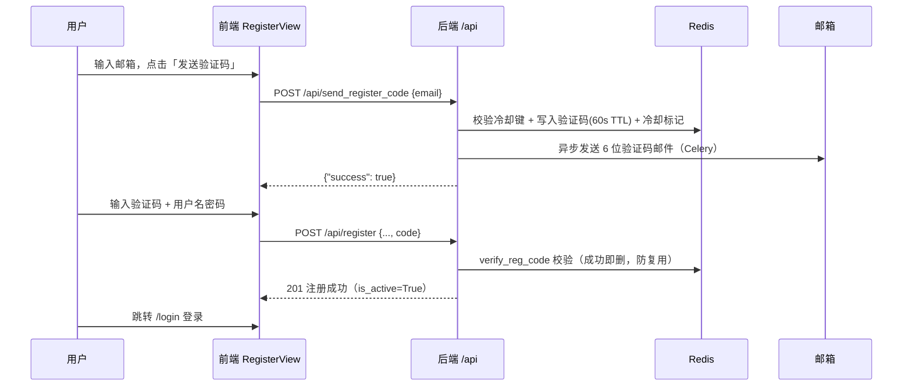
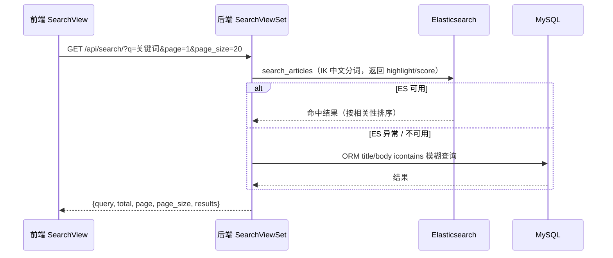
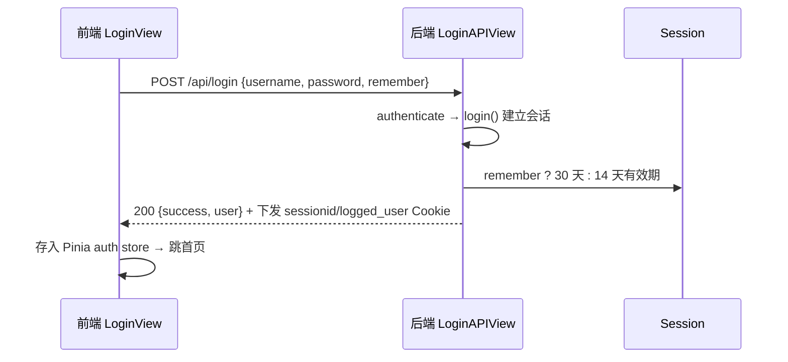

# WhrBlog 项目深度上手分析报告

> 生成方式：静态文本读取，未执行任何项目代码。
> 覆盖范围：后端（Django 5.2）、前端（Vue 3）、容器化部署、测试与 CI、外部服务集成。
> 生成日期：2026-08-21（含近期注册验证码、默认头像、种子数据、接口文档等改动）。

---

## 1. 项目概要

**一句话定位**：前后端分离的个人博客系统，Django 提供纯 REST API，Vue3 独立 SPA 消费接口，Docker Compose 一键部署 7 个服务，已上线 47.113.150.22。

| 元数据 | 值 |
|--------|-----|
| 项目名称 | whrblog（后端包 `whrblog`，前端包 `whrblog-frontend`） |
| Python 版本 | 3.12（Dockerfile 基础镜像 `python:3.12-slim`，CI 同样 3.12） |
| Node 版本 | 20（`Dockerfile.frontend` 用 `node:20-alpine`，CI 用 node 20） |
| 后端框架 | Django 5.2.16 + DRF 3.15.2 |
| 前端框架 | Vue 3.5 + Vite 6 + Pinia + Tailwind CSS 3.4 |
| 后端包管理器 | pip + `requirements.txt`（无 pyproject.toml） |
| 前端包管理器 | npm（`package-lock.json`，CI 用 `npm ci`） |
| 数据库 | MySQL 8.0（业务数据） |
| 缓存 / 队列 | Redis 7（缓存 + 验证码 + Celery broker） |
| 搜索引擎 | Elasticsearch 9.4.3 + IK 中文分词（自构建 `deploy/es/Dockerfile`） |
| 架构类型 | **前后端分离同仓项目**（独立 `frontend/` 工程，Python 仅提供 API） |

---

## 2. 技术栈全景图

| 分类 | 技术 |
|------|------|
| Web 框架 | Django 5.2.16 + Django REST Framework 3.15.2 |
| WSGI 服务器 | Gunicorn（gthread worker，生产）/ `runserver`（开发） |
| 数据库 ORM | Django ORM + `mysqlclient`，Django migrations |
| 序列化校验 | DRF Serializer（3 个 app 各有 `serializers.py`） |
| 缓存 | Django RedisCache（`django.core.cache.backends.redis.RedisCache`） |
| 异步任务 | Celery 5.6（Broker/Result 均 Redis，复用 `DJANGO_REDIS_URL`） |
| 全文搜索 | `elasticsearch` 官方客户端（`core/es_client.py`，IK 分词） |
| Markdown / 安全 | `Markdown` + `bleach` 白名单清洗 + 插件管线（`core/utils.py`、`core/plugin_manage/`） |
| 图片处理 | Pillow（图床压缩、头像转码） |
| 压缩静态资源 | django-compressor + Pygments（代码高亮） |
| 前端框架 | Vue 3.5 + Vue Router 4 + Pinia 2.3 |
| 前端构建 | Vite 6 + Terser（激进压缩）+ Tailwind CSS 3.4 + @tailwindcss/typography |
| 前端请求 | 原生 fetch 封装（`frontend/src/api.js`，非 axios） |
| 部署 | Docker Compose（7 服务）+ Nginx + Gunicorn |
| 测试 | pytest 9 + pytest-django 4.14 + coverage |
| CI/CD | GitHub Actions：`ci.yml`（后端测试+前端构建）+ `deploy.yml`（SSH 手动部署） |

---

## 3. 目录结构与架构说明

```
whrblog/
├── manage.py                 # Django 管理入口
├── requirements.txt          # 后端依赖（pip）
├── pytest.ini                # pytest 配置（--reuse-db）
├── docker-compose.yml        # 7 服务编排
├── Dockerfile                # 后端镜像（Python 3.12 + Gunicorn）
├── Dockerfile.frontend       # 前端多阶段构建（Node 编译 → Nginx 托管）
├── .env / .env.example / .env.prod   # 环境变量（示例可入库，生产模板）
├── .github/workflows/        # ci.yml（测试+构建） / deploy.yml（SSH 部署）
│
├── whrblog/                  # Django 工程配置包
│   ├── settings.py           # 全部配置（.env + dotenv 加载）
│   ├── urls.py               # 根路由：health/admin/sitemap/3 个 app 路由
│   ├── wsgi.py / asgi.py     # 部署入口（gunicorn 用 wsgi）
│   ├── celery.py             # Celery 实例
│   └── management/commands/  # loadseed（空库自动灌种子）
│
├── apps/                     # 业务应用（Django 多应用架构）
│   ├── blog/                 # 文章/分类/标签/设置/搜索/图床（viewsets + APIView）
│   ├── accounts/             # 用户/注册/登录/验证码/头像（APIView + 邮件）
│   └── comments/             # 评论/回复/Emoji 反应（ViewSet）
│
├── core/                     # 公共能力层
│   ├── utils.py              # 缓存封装/Markdown 渲染/邮件/验证码生成
│   ├── es_client.py          # ES 客户端（索引/同步/搜索/降级）
│   ├── tasks.py              # Celery 任务（ES 同步、邮件）
│   ├── blog_signals.py       # 信号（文章变更→ES、清缓存、发邮件）
│   ├── pagination.py         # PageSizePagination（自描述分页）
│   ├── plugin_manage/        # 插件系统（hooks 过滤器）
│   ├── admin_site.py / logentryadmin.py  # 自定义 Admin
│   ├── sitemap.py / error_views.py / constants.py
│   └── tests/
│
├── plugins/                  # 内置插件：article_copyright / external_links / image_lazy_loading
├── frontend/                 # Vue3 SPA 工程
│   ├── src/main.js           # 入口：createApp + Pinia + Router + 深色模式
│   ├── src/router.js         # 14 个页面路由
│   ├── src/api.js            # fetch 封装（CSRF/401 拦截/429 友好文案）
│   ├── src/stores/           # Pinia：auth（登录态）/ site（站点信息）
│   ├── src/views/            # 15 个页面组件
│   ├── src/components/ features/ styles/
│   └── vite.config.js        # 构建 + 开发代理（/api → Django）
│
├── deploy/                   # 部署资产
│   ├── entrypoint.sh         # 容器启动脚本（迁移/种子/静态/ES/gunicorn）
│   ├── gunicorn.conf.py      # Gunicorn 生产配置
│   ├── nginx/                # nginx.conf + conf.d（反代/静态/SPA fallback）
│   ├── es/Dockerfile         # ES 9.4.3 + IK 分词镜像
│   └── seed/seed.json        # 种子数据（用户/分类/标签/文章，随代码分发）
│
├── docs/                     # 文档（api.md 接口文档、docker 部署指南、本报告）
├── uploads/                  # MEDIA_ROOT（头像/图床图片，gitignore）
└── collectedstatic/          # collectstatic 产物（gitignore）
```

**架构模式总结**：Django 多应用（MVC/MTV）+ 分层（apps 业务层 / core 公共层 / whrblog 工程层）；前端为纯 SPA（无服务端渲染），前后端通过 `/api` 同域接口通信。

---

## 4. 本地启动完整指南

### 4.1 前置依赖

- Python 3.12、Node 20、Docker（可选，用于 MySQL/Redis/ES 中间件）
- 依赖库：MySQL（mysqlclient 需编译依赖：gcc、libmysqlclient-dev）

### 4.2 快速启动命令速查表

| 动作 | 后端命令 | 前端命令 |
|------|----------|----------|
| 启动中间件（推荐） | `docker compose up -d mysql redis elasticsearch` | — |
| 装依赖 | `venv/Scripts/pip install -r requirements.txt` | `cd frontend && npm install` |
| 迁移/种子 | `python manage.py migrate --fake-initial` → `python manage.py loadseed` | — |
| 启动开发服务 | `python manage.py runserver 0.0.0.0:8000` | `cd frontend && npm run dev` |
| 起异步任务 | `celery -A whrblog worker -l info`（邮件/ES 同步必需） | — |
| 联调验证 | 访问 `http://127.0.0.1:8000/health/`、`/api/articles/` | 访问 `http://localhost:5173` |

### 4.3 分步启动流程

1. **环境变量**：`cp .env.example .env`，按需改数据库/Redis/ES 密码（本地拓扑：MySQL 用 127.0.0.1，Redis/ES 用 Docker）。
2. **中间件**：`docker compose up -d mysql redis elasticsearch`（或使用本机已装 MySQL）。
3. **后端**：创建 venv → `pip install -r requirements.txt` → `migrate` → `loadseed`（空库自动灌种子）→ `runserver`。
4. **Celery worker**：另开终端起 worker，否则邮件发送（异步任务）不生效。
5. **前端**：`npm install` → `npm run dev`，Vite 将 `/api`、`/media`、`/admin` 代理到 `127.0.0.1:8000`。
6. **验证**：打开 `http://localhost:5173`，能看文章列表即联调成功；注册一个账号走通「发送验证码 → 输入验证码 → 注册成功」流程。

---

## 5. 前后端联调机制

| 项目 | 说明 |
|------|------|
| 跨域 | **无需 CORS**：开发用 Vite 代理同域，生产用 Nginx 同域反代（未安装 django-cors-headers） |
| 开发代理 | `frontend/vite.config.js`：`/api`、`/media`、`/admin`、`/sitemap.xml`、`/health` → `http://127.0.0.1:8000`（可用 `API_PROXY_TARGET` 覆盖） |
| 接口前缀 | 后端统一 `/api` 前缀；前端 `api.js` 直接用相对路径（同域） |
| 认证传递 | **Session Cookie**：登录后 `sessionid`（HttpOnly）+ `logged_user`（HttpOnly）；前端 401 全局拦截跳 `/login?next=...` |
| CSRF | 写操作需 `X-CSRFToken` 请求头（从 `csrftoken` Cookie 读取，`api.js` 自动附加） |
| 登录态 | Pinia `auth` store 启动时 `GET /api/user` 恢复登录态 |
| 联调验证地址 | 后端 `http://127.0.0.1:8000/health/`；前端 `http://localhost:5173`；接口文档 `docs/api.md` |

---

## 6. 核心入口与启动链路

### 6.1 后端

- 入口：`manage.py` → `whrblog/wsgi.py`（生产 gunicorn 加载）。
- 初始化顺序：`settings.py`（`load_dotenv` 加载 `.env` → 各配置段）→ `urls.py`（健康检查/Admin/sitemap → `apps.blog.urls`、`apps.comments.urls`、`apps.accounts.urls`）→ 各 app 的 `apps.py`（如 `AccountsConfig.ready()` 会自动把默认头像复制进 MEDIA_ROOT）。
- **容器内启动链路**（`deploy/entrypoint.sh`）：等 MySQL 就绪 → `migrate --fake-initial` → `loadseed`（空库灌种子）→ `collectstatic --clear` → `compress`（django-compressor）→ `rebuild_es_index`（失败降级）→ `exec gunicorn`（前台运行，容器不退）。
- 中间件：Security → Session → GZip → Common → CSRF → Auth → Messages → XFrameOptions → ConditionalGet。
- 全局异常：`handler404/500/403` 指向 `core/error_views.py`。

### 6.2 前端

- 入口：`frontend/src/main.js` → `createApp` → `use(createPinia())` → `use(router)` → 挂载 + `initDarkMode()`。
- 路由：`router.js` 14 条（首页/文章/分类/标签/作者/友链/搜索/登录/注册/找回密码/用户中心/写作/草稿箱/邮箱验证），`createWebHistory`（HTML5 History）。
- 请求封装：`api.js`（fetch 封装：CSRF 自动附加、401 跳登录、429 解析 Retry-After 转友好文案、错误统一提取）。
- 构建：`vite build` 输出 `frontend/dist`，生产由 Nginx 托管（`Dockerfile.frontend` 多阶段：Node 构建 → Nginx 托管）。

---

## 7. 数据模型与数据库

| 模型 | 位置 | 职责 / 关键字段 |
|------|------|-----------------|
| `BlogUser` | apps/accounts | 自定义用户（AbstractUser）：`nickname`、`avatar`（CharField 存 URL 字符串）、`source` |
| `Article` | apps/blog | 文章：`title`（唯一）、`body`（Markdown）、`status`（p/d）、`type`（a/p）、`views`、`is_top`、`show_toc`、`author` FK→用户、`category` FK→分类、`tags` M2M→标签 |
| `Category` | apps/blog | 分类：`name`（唯一）、`parent_category` 自引用（多级）、`slug`、`index` |
| `Tag` | apps/blog | 标签：`name`（唯一）、`slug` |
| `Links` | apps/blog | 友情链接：`link`、`sequence`、`show_type` |
| `SideBar` | apps/blog | 侧边栏 HTML 块 |
| `BlogSettings` | apps/blog | 站点配置（**单例语义**，仅 `clean()` 约束非 DB 约束）：site_name、SEO、配色、广告、公安备案等 |
| `Comment` | apps/comments | 评论：`body`（≤300）、`author` FK、`article` FK、`parent_comment` 自引用、`is_enable`（审核） |
| `CommentReaction` | apps/comments | 评论表情：`comment`+`user`+`reaction_type` 唯一（8 种 emoji） |

**表关系**：Category 自关联（父子分类）；Article→Category 多对一、Article→Tag 多对多（中间表 `blog_article_tags`）、Article→User 多对一；Comment→Article/User 多对一、自关联（回复树）；CommentReaction→Comment/User 多对一。

**迁移方式**：Django migrations（`apps/*/migrations/`），命令 `python manage.py migrate`；容器与 CI 均执行。

---

## 8. API 接口总览

完整字段级文档见 `docs/api.md`（40+ 接口，含请求/响应示例）。速览：

| 模块 | 接口数 | 代表性接口 | 认证 |
|------|--------|------------|------|
| accounts | 12 | `POST /api/register`、`POST /api/send_register_code`、`POST /api/login`、`GET/PATCH /api/user`、`POST /api/verify_email`、`POST /api/forget_password`、`POST /api/change_password/change_email`、`POST /api/upload_avatar` | 公开 / 需登录 |
| blog | 23 | `GET /api/articles/`、`GET /api/articles/<id>/`、`POST /api/article_create`、草稿 5 操作、`GET /api/search/`、`GET /api/siteinfo/`、`GET /api/sidebar/`、`POST /api/upload`、`POST /api/clean_cache` | 公开读 / 管理员写 |
| comments | 5 | `GET/POST /api/comments/`、`GET/POST /api/comments/<id>/react/` | 公开读 / 登录写 |
| system | 4 | `GET /health/`、`GET /sitemap.xml`、`/admin/`、`/media/`、`/static/` | 公开 / 管理员 |

**统一规范**：分页信封 `{count, page, page_size, next, previous, results}`（`PageSizePagination`，page_size 上限 100，搜索接口上限 50 且结构独立）；错误以 `{"error": "..."}` 或 DRF 字段错误返回；限流返回 429。

---

## 9. 核心业务流程详解

### 9.1 注册 + 邮箱验证码（单页内联）



要点：验证码 1 分钟有效 + 每邮箱 1 分钟冷却 + IP 限流（20/hour）三层防刷；前端 429 时自动进入倒计时。

### 9.2 文章搜索（ES 优先，ORM 降级）



要点：ES 降级不静默——记录 warning 日志；文章发布/更新/删除通过 Celery 异步任务 + Django 信号同步索引。

### 9.3 登录（Session + 记住我）



---

## 10. 配置与环境变量

| 项目 | 说明 |
|------|------|
| 加载机制 | `settings.py` 顶部 `load_dotenv()`；用 `env_to_bool/env_to_int/env_to_list` 等 helper 解析 `.env` |
| 环境文件 | `.env`（本机）、`.env.example`（开发默认值，可入库）、`.env.prod`（生产模板） |
| 后端关键配置 | `DJANGO_SECRET_KEY`、`DJANGO_DEBUG`、`DJANGO_ALLOWED_HOSTS`、`DJANGO_MYSQL_*`、`REDIS_PASSWORD`/`DJANGO_REDIS_URL`、`ES_HOST`/`ES_PASSWORD`、`DJANGO_EMAIL_*`（SMTP）、`DJANGO_SECURE_SSL`、`SESSION_COOKIE_AGE`、`REMEMBER_ME_LOGIN_TTL`（存在该配置项，值已脱敏） |
| 前端配置 | `VITE_DEV_SERVER_URL`、`API_PROXY_TARGET`（vite 代理目标） |
| 多环境切换 | 本地 `.env` / Docker 内置默认值 / 生产 `.env.prod`；`DEBUG`、`ALLOWED_HOSTS`、`SECURE_SSL` 三开关是关键 |
| 陷阱提示 | 纯 HTTP 部署时 `DJANGO_SECURE_SSL=False`，否则 Session/CSRF Cookie 带 Secure 标记导致登录失败 |

---

## 11. 外部服务集成说明

| 服务 | 用途 | 集成位置 | 本地替代方案 | 排查要点 |
|------|------|----------|--------------|----------|
| MySQL 8.0 | 业务数据 | `whrblog/settings.py` DATABASES | docker-compose 或本机 | 连接用服务名 `mysql`（容器内）/`127.0.0.1`（本地）；`mysqladmin ping` healthcheck |
| Redis 7 | 缓存 + 验证码 + Celery broker/result | `CACHES`（RedisCache）、`core/utils.py`、Celery | docker-compose | 密码 `--requirepass`；缓存键带 `:1:` 前缀（清限流键要注意） |
| Elasticsearch 9.4 | 全文搜索（IK 分词） | `core/es_client.py`、`core/tasks.py` | docker-compose（自构建带 IK） | ES 9 默认启用安全认证（TLS+密码）；不可用时搜索自动降级 ORM |
| SMTP（QQ 邮箱） | 注册/找回密码验证码、评论通知 | `core/utils.py` send_email（Celery 异步） | 无需真实发信可留空 | **必须起 Celery worker**，否则邮件不发送；`DJANGO_EMAIL_PASSWORD` 需授权码 |
| Django Admin | 后台管理 | `core/admin_site.py` | 内置 | 访问 `/admin/`，需超管账号 |

---

## 12. 认证与权限体系

- **认证方式**：Session Cookie（DRF `SessionAuthentication`），非 JWT/Token。登录写 `sessionid` + `logged_user` Cookie（HttpOnly、SameSite=Lax）。
- **CSRF**：写操作校验，前端 `api.js` 自动附加 `X-CSRFToken`。
- **权限层级**：全局默认 `IsAuthenticatedOrReadOnly`；账号敏感接口 `IsAuthenticated`；文章增删改/草稿/图床/清缓存 `IsAdminUser`；公开接口 `AllowAny`。
- **用户模型**：`BlogUser`（AbstractUser 子类，AUTH_USER_MODEL），`is_superuser` 即管理员。
- **前端权限**：Pinia `auth` store 保存登录态；`api.js` 401 全局拦截跳转登录页；页面按 `user.is_superuser` 控制后台入口（写作/草稿箱）。
- **限流**：全局 anon 100/min、user 1000/min；邮件类接口 3/hour；注册发码 20/hour；找回密码 10/hour；另有每邮箱 1 分钟冷却。

---

## 13. 日志与异常处理

| 项目 | 说明 |
|------|------|
| 日志框架 | 标准库 `logging`（`settings.py` LOGGING） |
| 输出 | console（stdout）+ mail_admins（ERROR 邮件，仅生产）；格式 `[时间] 级别 [模块.函数:行号] 消息` |
| 生产采集 | gunicorn/`entrypoint.sh` 全部输出 stdout → Docker logs（`docker compose logs -f backend`） |
| 全局异常 | `handler404/500/403` → `core/error_views.py`（JSON/页面） |
| 前端错误 | `api.js` 统一 `extractError`；429 转「请求过于频繁，请稍后约 X 分钟再试」；401 跳登录 |
| 请求追踪 | 无 request-id 全链路追踪（待确认） |
| 监控 | `/health/` 健康检查（compose 各服务 healthcheck 依赖它）；无 Sentry 接入 |

---

## 14. 测试与代码规范

| 项目 | 说明 |
|------|------|
| 测试框架 | pytest + pytest-django（`pytest.ini`：`--reuse-db`、`--tb=short`） |
| 测试位置 | `core/tests/`、`apps/accounts/tests/`、`apps/blog/tests/`、`apps/comments/tests/` |
| 运行命令 | `pytest`（当前 187 passed，README badge） |
| 覆盖率 | `coverage` 已装（配置未发现强制阈值，待确认） |
| 前端测试 | 未发现前端单测框架（待确认） |
| 代码规范 | 后端未见 ruff/black/isort/mypy 配置（待确认）；前端无 ESLint/Prettier 配置（待确认） |
| CI 检查 | `ci.yml`：后端测试（GitHub Actions services 起 MySQL/Redis）+ 前端 `npm ci && npm run build` |
| 提交规范 | 未发现 commitlint/分支规范（待确认） |

---

## 15. 部署与运维说明

### 15.1 容器化

- **后端镜像** `Dockerfile`：python:3.12-slim → 清华源加速 → 编译依赖 → `pip install -r requirements.txt` → `ENTRYPOINT /app/entrypoint.sh`（EXPOSE 8000）。
- **前端镜像** `Dockerfile.frontend`：多阶段（node:20-alpine 构建 → nginx:1.27-alpine 托管 dist）。
- **ES 镜像** `deploy/es/Dockerfile`：ES 9.4.3 + IK 中文分词。
- **compose 7 服务**：nginx、frontend、backend、worker、mysql、redis、elasticsearch。
  - 网络：`whrblog-net`（bridge），容器间用服务名互访。
  - 卷：`mysql_data / redis_data / es_data / static_data / media_data / frontend_dist`（共享与持久化）。
  - 启动依赖：`depends_on + condition: service_healthy`（mysql/redis/es 健康 → backend/worker → nginx）。
  - 端口：仅 nginx 暴露 `80:80`。
  - 种子：`./deploy/seed:/app/seed:ro`，空库自动 `loadseed`。

### 15.2 生产运行

- **后端**：Gunicorn gthread（`workers = CPU*2+1`、`threads=4`、`max_requests=1000` 防泄漏、stdout 日志）。
- **前端**：Nginx 托管 SPA 构建产物 + `/api` 反代 backend + `/media`/`/static` 静态服务 + SPA history fallback。
- **部署流程**（`deploy.yml`）：SSH 上服务器 → `git pull` → `docker compose build backend frontend` → `up -d` → 清理旧镜像；手动触发。
- **上线地址**：47.113.150.22（纯 HTTP，Nginx IP 直访）。

---

## 16. 新手快速上手路线（5 步）

1. **启动中间件**：`docker compose up -d mysql redis elasticsearch`（MySQL/Redis/ES 就绪）。
2. **后端跑通**：`cp .env.example .env` → 建 venv 装依赖 → `migrate` → `runserver`，访问 `/health/` 与 `/api/articles/` 验证。
3. **前端跑通**：`cd frontend && npm install && npm run dev`，打开 `http://localhost:5173` 看文章列表。
4. **走通核心流程**：注册新账号（发送验证码 → 邮箱收码 → 输入验证码 → 注册成功 → 登录），验证前后端联调。
5. **做一次小改动**：在 `apps/blog` 加一个接口 + `frontend/src/views` 加页面调用，体验全链路开发。

---

## 17. 避坑指南与注意事项

| 优先级 | 坑点 | 解决方案 |
|--------|------|----------|
| P0 | **Celery worker 未启动 → 邮件发不出**（注册码/找回密码/通知全异步） | 另开终端 `celery -A whrblog worker -l info`；或临时 `CELERY_TASK_ALWAYS_EAGER=True` 同步执行 |
| P0 | **`DJANGO_SECURE_SSL=True` 纯 HTTP 部署 → 登录/CSRF 失败**（Cookie 带 Secure） | 纯 HTTP 必须 `False`；上 HTTPS 后再开 |
| P1 | **DRF 限流 429**：`email` scope 3/hour 被 4 个邮件接口共享，测试易撞墙，文案中英混杂 | 已拆独立 `register_code` scope（20/hour）；前端 `api.js` 已做 429 友好文案+自动倒计时；清缓存键带 `:1:` 前缀（如 `:1:throttle_email_127.0.0.1`） |
| P1 | **8000 端口叠两个 runserver**（重启后旧进程未杀） | `netstat -ano | findstr :8000` 找到 PID 后 `taskkill /PID <pid> /F` |
| P1 | **邮件链接 404**：`/verify-email` 无路由、或跑旧代码发旧链接 | 确认 url 路由与视图存在；重启后强刷；改 `RegisterView` 走单页内联验证后已绕开 |
| P1 | **`BlogSettings` 有 2 行重复**（唯一性仅 `clean()` 非 DB 约束） | 删除重复行；当前种子已排除该表 |
| P2 | **`uploads/` 被 gitignore**：上传数据与默认头像不入库，新服务器缺失 | 默认头像已改为随代码静态资源 + `AccountsConfig.ready()` 自动落盘；用户上传文件需手动/卷同步 |
| P2 | **`loaddata` 不自动排外键序**：种子文件必须按依赖顺序 dump | 用 `dumpdata accounts.bloguser blog.category blog.tag blog.article`（依赖在前）；`Article.tags` M2M 内联输出无需单独导出 |
| P2 | **前后端分页耦合**：前端硬编码 page_size | 已抽象 `PageSizePagination`，前端从响应读 `page_size` |
| P2 | **Windows + Vite build 失败**（WorkBuddy safe-delete trash 对 `dist/.vite` 报错） | `rm -rf dist` 后重 build（环境问题非代码问题） |
| P2 | **本地拓扑变更**（本机 MySQL + Docker Redis/ES）后连不上 | `.env` 里 `DJANGO_MYSQL_HOST=127.0.0.1`、`REDIS_HOST=127.0.0.1`、`ES_HOST=http://localhost:9200`（密码保持共享 `whr-blog-2026-*` 体系） |
| P3 | ES 不可用时搜索静默失效 | 已做降级：ES 异常回退 ORM 模糊查询并记 warning；排查 `docker compose logs backend \| grep ES` |
